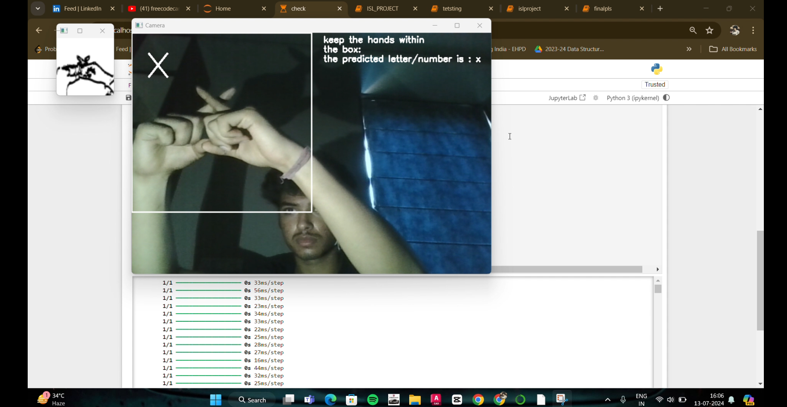

# 🤟 ISL Recognition using CNN (Indian Sign Language Project)

This project is a computer vision-based real-time Indian Sign Language (ISL) recognition system. It uses a **Convolutional Neural Network (CNN)** trained on sign language data to recognize **alphabets (a–z)** and **digits (0–9)** from webcam input.

---


## 📌 Demo ScreenShot

<p align="center">
  
  <br>
  <i>📸 Live prediction of sign language letter from webcam feed</i>
</p>


---

## 📌 Key Features

- ✋ Real-time gesture capture using OpenCV
- 📐 Preprocessing with Canny edge detection and dilation
- 🧠 Trained CNN model using Kaggle dataset
- 🔤 Recognizes 36 characters (0-9 and a-z)
- 📦 Easily extendable and lightweight
- 🖥️ Live feedback overlay on webcam

---

## 🧠 Model Architecture

```python
cnn = keras.models.Sequential([
    keras.layers.Conv2D(32, (3,3), activation='relu', input_shape=(64,64,3)),
    keras.layers.MaxPooling2D((2,2)),
    keras.layers.Conv2D(64, (3,3), activation='relu'),
    keras.layers.MaxPooling2D((2,2)),
    keras.layers.Flatten(),
    keras.layers.Dense(64, activation='relu'),
    keras.layers.Dense(36, activation='softmax')  # 26 letters + 10 digits
])
